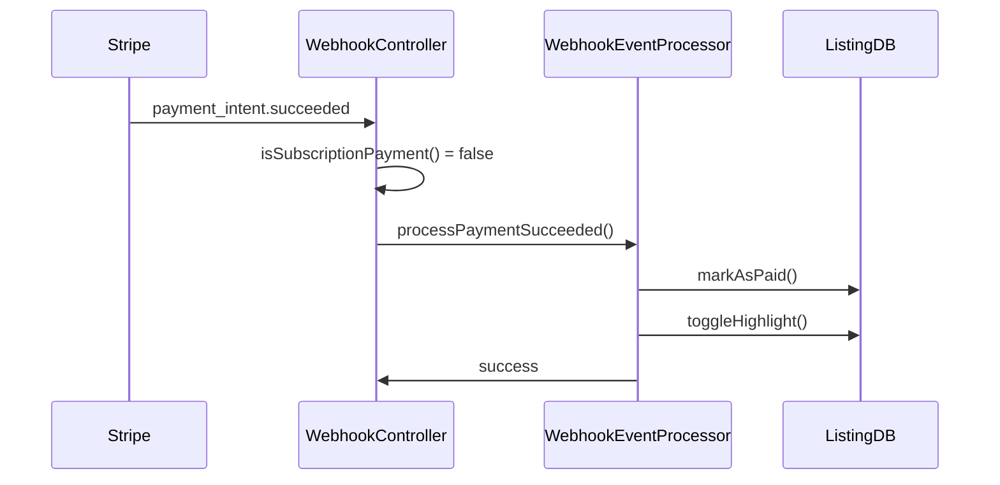
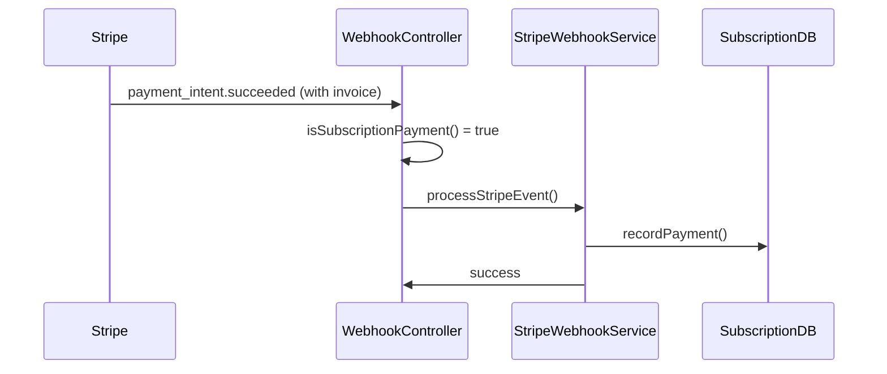

# Webhook Event Routing Architecture

## Overview

This document explains the enhanced webhook architecture that properly separates listing payment processing from subscription payment processing, preventing both handlers from firing on the same payment event.

## Architecture Components

### 1. WebhookController (Primary Router)

**File**: `backend/controllers/webhookController.js`

**Responsibilities**:

- Receives all Stripe webhook events
- Validates webhook signatures
- Routes events to the correct processor based on event type and payment context
- Provides comprehensive logging and error handling
- Tracks webhook event processing in database

**Key Methods**:

- `processEventByType()` - Main routing logic
- `isSubscriptionPayment()` - Determines if payment intent is subscription-related
- `isSubscriptionCharge()` - Determines if charge is subscription-related

### 2. WebhookEventProcessor (Listing Payments)

**File**: `backend/service/webhookEventProcessor.js`

**Responsibilities**:

- Processes payment events for car listing purchases
- Handles listing highlight functionality
- Manages listing payment emails
- Updates listing payment status in database

**Handled Events**:

- `payment_intent.succeeded` (listing payments only)
- `payment_intent.payment_failed` (listing payments only)
- `charge.succeeded` (listing charges only)
- `charge.failed` (listing charges only)

### 3. StripeWebhookService (Subscription Payments)

**File**: `backend/service/stripeWebhookService.js`

**Responsibilities**:

- Processes all subscription-related webhook events
- Manages subscription lifecycle (created, updated, deleted)
- Handles subscription payment events
- Manages invoice events
- Records subscription payments in database
- Handles company subscription activation

**Handled Events**:

- `checkout.session.completed`
- `customer.subscription.created`
- `customer.subscription.updated`
- `customer.subscription.deleted`
- `payment_intent.succeeded` (subscription payments only)
- `payment_intent.payment_failed` (subscription payments only)
- `charge.succeeded` (subscription charges only)
- `charge.failed` (subscription charges only)
- `invoice.payment_succeeded`
- `invoice.payment_failed`
- `invoice.finalized`
- `invoice.updated`
- `invoice.paid`
- `invoice_payment.paid`

## Event Routing Logic

### Payment Intent Events

When a `payment_intent.succeeded` or `payment_intent.payment_failed` event is received:

1. **Check if subscription payment**:

   - Has `metadata.subscriptionId` or `metadata.subscription_id`
   - Has `metadata.accountType === 'company'` with `metadata.companyId`
   - Has `metadata.type === 'subscription'`
   - Has `invoice` property (invoice-based payments)
   - Description contains subscription keywords

2. **Route accordingly**:
   - **Subscription payment** → `StripeWebhookService`
   - **Listing payment** → `WebhookEventProcessor`

### Charge Events

When a `charge.succeeded` or `charge.failed` event is received:

1. **Check if subscription charge**:

   - Has `metadata.subscriptionId` or similar subscription indicators
   - Has `invoice` property (subscription billing)
   - Has company subscription metadata
   - Description contains subscription keywords

2. **Route accordingly**:
   - **Subscription charge** → `StripeWebhookService`
   - **Listing charge** → `WebhookEventProcessor`

## Payment Type Detection

### Subscription Payment Indicators

```javascript
// Direct subscription metadata
metadata: {
  subscriptionId: 'sub_123',
  type: 'subscription',
  payment_type: 'subscription'
}

// Company subscription metadata
metadata: {
  accountType: 'company',
  companyId: 'comp_123'
}

// Invoice-based payments
{
  invoice: 'in_123' // Any payment with invoice is subscription
}

// Description keywords
description: 'Monthly subscription', 'Yearly plan', 'Recurring payment'
```

### Listing Payment Indicators

```javascript
// Listing metadata
metadata: {
  items: '[{"type":"listing","highlight":true}]',
  listing_id: '123'
}

// No subscription indicators
// No invoice property
// Non-subscription description
```

## Database Integration

### SubscriptionDatabase Service

**File**: `backend/service/subscriptionDatabase.js`

**Key Methods**:

- `recordPayment()` - Records subscription payments
- `updatePaymentWithCharge()` - Updates payment with charge info
- `createOrUpdateSubscription()` - Manages subscription records

### Listing Payment Database

**File**: `backend/dbQueries/listed_cars.js`

**Key Methods**:

- `markAsPaid()` - Marks listing as paid
- `toggleHighlight()` - Manages listing highlight status

## Event Flow Examples

### Listing Payment Flow



### Subscription Payment Flow



## Error Handling

### Webhook Controller

- Validates all incoming events
- Logs comprehensive request/response data
- Tracks processing times
- Records webhook events in database
- Provides detailed error responses

### Event Processors

- Each processor handles its own error scenarios
- Failed events are logged with full context
- Database operations use transactions where appropriate
- Email sending is non-blocking to prevent failures

## Testing

### Test Coverage

**File**: `backend/test/webhook-event-routing.test.js`

**Test Scenarios**:

- Listing payments route to WebhookEventProcessor
- Subscription payments route to StripeWebhookService
- Company subscriptions route correctly
- Invoice-based payments route correctly
- Event type detection logic works properly

### Manual Testing

```bash
# Test webhook endpoint
curl -X POST http://localhost:3000/api/webhook/test \
  -H "Content-Type: application/json" \
  -d '{"test": true}'

# Test with Stripe CLI
stripe listen --forward-to localhost:3000/api/webhook
```

## Configuration

### Environment Variables

```env
# Webhook security
STRIPE_WEBHOOK_SECRET=whsec_xxx
ENDPOINT_SECRET=whsec_xxx  # Fallback

# Database
DATABASE_URL=postgresql://...

# Logging
NODE_ENV=production
LOG_LEVEL=info
```

### Webhook URL Setup

```
Production: https://yourdomain.com/api/webhook
Development: https://your-tunnel.ngrok.io/api/webhook
```

## Monitoring and Debugging

### Logging

- All webhook events are logged with request IDs
- Processing times are tracked
- Error details include full stack traces
- Event routing decisions are logged

### Database Tracking

- Webhook events stored in `webhook_events` table
- Processing status and results tracked
- Failed events can be replayed

### Stripe Dashboard

- Monitor webhook delivery status
- View failed webhook attempts
- Replay failed events

## Migration Notes

### Before (Problem)

- Both listing and subscription handlers fired for subscription payments
- No clear separation of concerns
- Duplicate processing and potential conflicts

### After (Solution)

- Clear routing logic based on payment context
- Separation of listing and subscription processing
- Dedicated services for each payment type
- Comprehensive event tracking and debugging

## Best Practices

1. **Always check payment context** before processing
2. **Use metadata** to identify payment types
3. **Log routing decisions** for debugging
4. **Handle errors gracefully** without affecting other events
5. **Test thoroughly** with different payment scenarios
6. **Monitor webhook delivery** in production
7. **Keep handlers focused** on their specific responsibilities

## Future Enhancements

1. **Webhook Event Replay** - System to replay failed events
2. **Event Analytics** - Dashboard for webhook event insights
3. **Payment Reconciliation** - Automated payment verification
4. **Rate Limiting** - Prevent webhook abuse
5. **Event Deduplication** - Handle duplicate webhook deliveries
6. **A/B Testing** - Test different payment flows

---

This architecture ensures that listing payments and subscription payments are handled by their respective specialized services, eliminating the overlap issue and providing a clear, maintainable system for webhook event processing.
